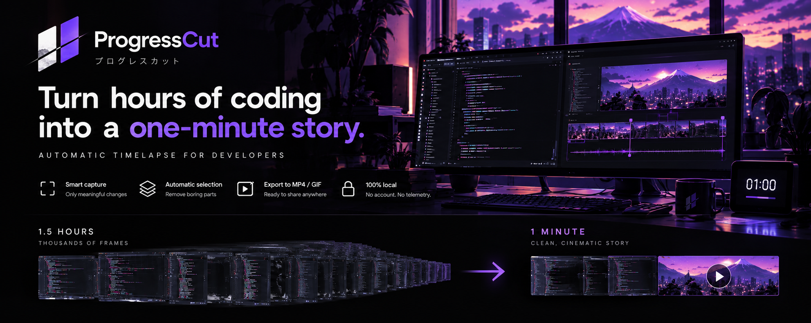

# ProgressCut



> Turn hours of coding into a one-minute build story. Automatically.

ProgressCut is a local-first macOS desktop app that captures your screen while you work and compresses the session into a short, shareable progress story — a GIF or MP4 that shows your actual progress without the noise.

**Core principle:** Record everything. Keep only what changed.

---

## How it works

1. **Capture** — screenshots every few seconds, adaptive rate (slows when idle, speeds up when active)
2. **Deduplicate** — removes visually identical frames using dHash + pixel diff
3. **Score** — ranks unique frames by structural novelty (tiled SSIM)
4. **Select** — stride sampling with novelty-peak picks guarantees temporal coverage
5. **Render** — FFmpeg assembles the story at your chosen target duration

All processing runs locally. No screenshots ever leave your machine.

## Requirements

- macOS (Screen Recording permission required on first launch)
- Node.js 22+
- pnpm 9+
- FFmpeg — `brew install ffmpeg`

## Quick start

```bash
pnpm install
pnpm desktop        # build and launch the app
```

## Development

Current milestone: [Launch Candidate 0.1](docs/launch-candidate-0.1.md).
Feature development is frozen while story quality, packaged-app reliability,
privacy and macOS distribution are validated.

```bash
pnpm typecheck      # type check all packages
pnpm test           # unit and integration tests
pnpm lint           # eslint
pnpm check          # typecheck + format + lint + test + line-length
pnpm bench          # dedup parallel benchmark
pnpm test:crash-recovery # macOS: isolated Electron + FFmpeg crash/restart smoke
```

Build a distributable:

```bash
pnpm run pack       # unpackaged .app (not the pnpm tarball command)
pnpm dist           # .dmg
pnpm test:packaged  # launch the built .app and export synthetic frames
```

## Story Lab

Turn a captured frame directory into an editorial-ready local report: a compression funnel,
activity timeline, selected-frame contact sheet, and machine-readable metrics.

```bash
pnpm --filter @progresscut/cli start -- report \
  ~/Desktop/progresscut-session/frames \
  ~/Desktop/progresscut-story-lab \
  --duration=60000
```

Open `~/Desktop/progresscut-story-lab/story-lab/index.html`. The report references local
frames only; no data is uploaded.

## Blind story-quality evaluation

```bash
pnpm --filter @progresscut/cli start -- compare \
  /absolute/session/frames /absolute/evaluation/session-01 \
  --duration=60000 --blind
```

Creates A/B/C exports and three reviewer kits with neutral clip names and rating
forms. Share only each reviewer's folder, never the labeled exports or private key.
See the [evaluation protocol](docs/launch-candidate-0.1.md#story-quality-evaluation-protocol)
before collecting results. Real-session quality validation is still pending.

## Repository structure

```
apps/
  desktop/          # Electron app — main process, preload, renderer
  cli/              # Batch capture and A/B/C pipeline comparison tool

packages/
  domain/           # Core types: FrameObservation, Story, StoryMoment…
  engine/           # Algorithms: dedup, novelty scoring, story selection
  capture/          # macOS screencapture adapter
  render/           # FFmpeg renderer

bench/              # Performance benchmarks
docs/adr/           # Architecture Decision Records
```

Architecture follows **Ports & Adapters**: `engine` and `domain` have zero platform dependencies; `capture` and `render` implement their ports; `apps/desktop` wires everything together. Enforced by ESLint import rules.

## Privacy

All processing is local. No screenshots leave your machine. No account required. No telemetry.

## License

MIT — see [LICENSE](LICENSE).
